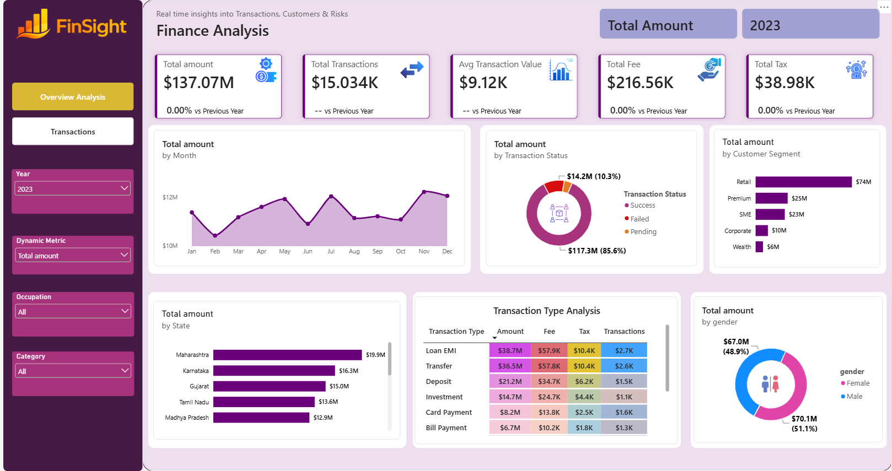

# Finance Analysis Dashboard | Power BI

An interactive Power BI report for exploring financial transactions and spotting patterns over time. I built this project as hands-on practice in preparing data, creating a data model, writing measures, and presenting the results in a clear dashboard.

## Project overview

The report brings financial data into one place so users can explore transaction amounts, compare periods, and investigate the figures behind the visuals. It also gave me practice troubleshooting a data model: the calendar relationship only produced the expected results after I corrected the transaction date column’s data type.

## 🛠️ Tools and skills

- **Power BI Desktop** — data modelling and report design
- **Power Query** — preparing data for analysis
- **DAX** — creating measures
- **Date relationships** — connecting transactions to a calendar table
- **Data visualisation** — making financial trends easier to explore

## 🔍 What I worked on

1. Loaded and prepared the financial data.
2. Connected the transaction table to a calendar table.
3. Created measures for analysing transaction amounts.
4. Built visuals to explore the data across different time periods.
5. Checked the relationships and data types when the results did not look right.

## 💡 A problem I solved

At one point, a measure was returning an unexpected result when I viewed amounts by year. The DAX measure itself was correct. The issue was that the transaction date column was stored as **text**, which affected its relationship with the calendar table. Changing it to a **date** resolved the problem.

That was a useful reminder that accurate analysis depends on the data model as well as the measures.

## 📁 Files

This repository contains the Power BI project file and any supporting data or dashboard images included in the repository.

> To explore the interactive report, download the `.pbix` file and open it in Power BI Desktop.

## 🎓 Learning resources

This project was built while following and practising with the two-part **Finance Analysis** tutorial by Data Tutorials:

- [Part 1 — Finance Analysis](https://youtu.be/xVC9GyXergs)
- [Part 2 — Finance Analysis Dashboard](https://youtu.be/97zcTmOOZS0)

The tutorials guided the project; the report in this repository documents my own hands-on practice and learning.

## 👩🏽‍💻 About me

I’m Radka, a Software Engineering graduate expanding my skills in data analysis and business intelligence. I enjoy working through the full journey from data and logic to a result people can actually use.

[GitHub profile](https://github.com/radQueen258)
